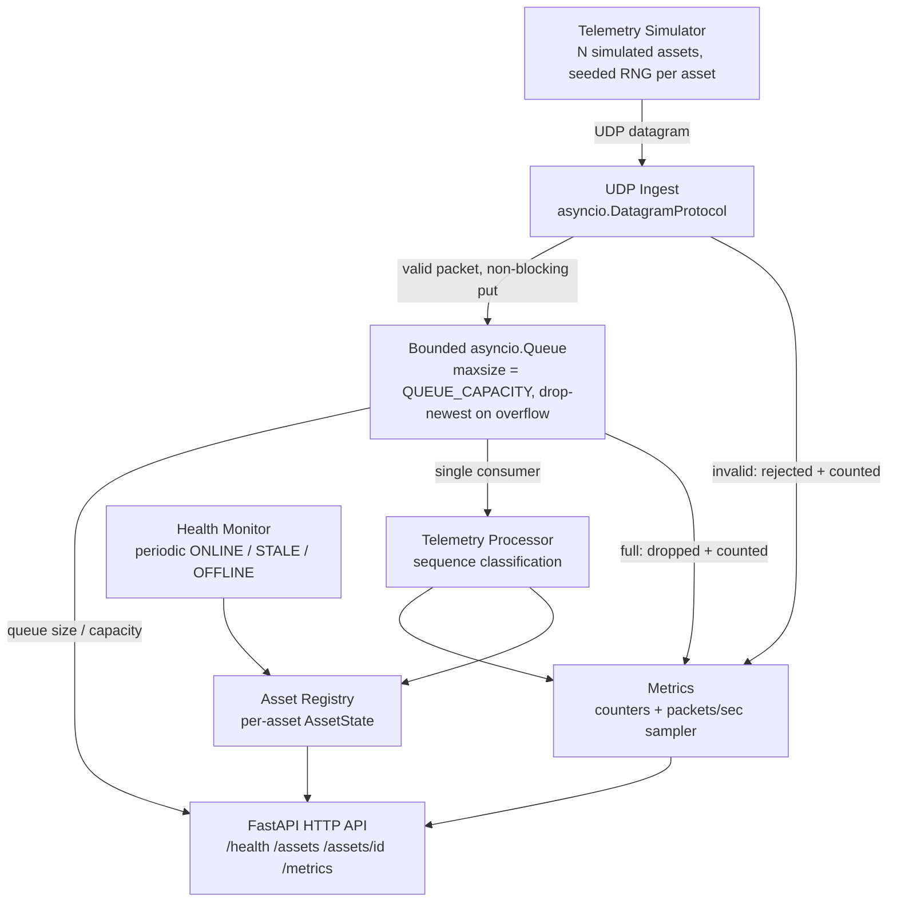

# ConstellationOps

A real-time telemetry backend that ingests satellite-style telemetry over UDP, processes it asynchronously, tracks per-asset sequence and health state, and exposes it all through a read-only HTTP API. This was built to demonstrate how a backend service can behave predictably on top of an unreliable network transport, with a deterministic fault-injecting simulator and a full end-to-end test suite to prove it.

## Why I Built This

Telemetry over a network doesn't arrive perfectly. Packets can be malformed, dropped, duplicated, or delivered out of order. A consumer can fall behind a producer. An asset can simply stop transmitting with no disconnect signal at all.

ConstellationOps is a small, inspectable system built to confront those problems directly rather than assume them away. It's not a simulation of orbital mechanics or a real satellite platform. It is a backend telemetry pipeline that treats UDP's unreliability as the actual problem to be solved, at the application layer, with observable and testable behavior.

## Architecture



| Component | Responsibility |
|---|---|
| **Simulator** | Generates concurrent per-asset UDP telemetry with configurable, seeded fault injection (drops, duplicates, reordering). |
| **UDP Ingest** | Owns the network boundary. Decodes and schema-validates every datagram; only valid telemetry is enqueued. |
| **Bounded Queue** | Fixed-capacity `asyncio.Queue` decoupling the network callback from processing. Never blocks, never grows unbounded. |
| **Telemetry Processor** | Single consumer that classifies each packet against its asset's sequence history (first/normal/gap/duplicate/out-of-order). |
| **Asset Registry** | In-memory `asset_id -> AssetState` map. Each asset's sequence history, counters, and health are isolated. |
| **Health Monitor** | Periodically derives ONLINE/STALE/OFFLINE per asset from elapsed time since last valid packet. |
| **Metrics** | Process-wide counters plus a periodically sampled `packets_per_second` rate. |
| **FastAPI API** | Read-only surface over the registry, metrics, and queue state — nothing here mutates the pipeline. |

## Reliability Model

| Scenario | System Behavior | Why |
|---|---|---|
| Malformed datagram | Rejected during decode/schema validation; never reaches the queue or asset state; counted in `packets_invalid_total` | Invalid input must never mutate trusted application state |
| Forward sequence gap | Classified `FORWARD_GAP`; `highest_sequence` still advances; gap size added to `sequence_gaps_total`, event counted in `forward_gap_event_count` | Separates *estimated missing telemetry* from a confirmed loss claim |
| Duplicate packet | Classified `DUPLICATE`; does not move `highest_sequence` or `latest_telemetry`; still refreshes `last_seen` | A resend proves the asset is still communicating even though it isn't progressing |
| Out-of-order / late packet | Classified `OUT_OF_ORDER`; recorded into bounded recent-sequence history without moving `highest_sequence` | Keeps sequence state monotonic while still acknowledging a legitimately received packet |
| Ingestion queue saturation | Receiver drops the incoming datagram (drop-newest) via `put_nowait`; `packets_queue_dropped_total` increments; processor and transport keep running | Non-blocking, explicit load-shedding instead of unbounded backlog growth |
| Asset goes silent | Health monitor recomputes elapsed time since `last_seen` every `HEALTH_CHECK_INTERVAL_SECONDS`; state moves ONLINE → STALE → OFFLINE | UDP has no disconnect signal, so silence must be inferred from elapsed time |
| Injected drop / duplicate / reorder | Simulator's per-asset seeded RNG reproduces the identical fault pattern for a given seed | Makes reliability scenarios deterministic and testable despite async scheduling |

## Key Engineering Decisions

### UDP ingestion
UDP gives no delivery, ordering, or dedup guarantees — which is exactly the point. Using it forces loss detection, duplicate handling, and reordering logic to live in the application instead of being hidden by the transport. TCP would have quietly solved the problem this project exists to demonstrate.

### Bounded queue + drop-newest
`datagram_received` is a synchronous callback on `asyncio.DatagramProtocol`, not a coroutine — it cannot `await queue.put()`. `put_nowait` on a fixed-size `asyncio.Queue` keeps the receiver non-blocking under any load. On overflow, the *incoming* packet is dropped rather than evicting something already queued: there's no priority signal that makes a queued packet less valuable, and evicting one would mean reaching into the queue's internals for no real benefit. Every drop increments `packets_queue_dropped_total`, so overload is always visible, never silent.

### Sequence tracking
Each `AssetState` keeps a `highest_sequence` plus a bounded `recent_sequences` window (a deque paired with a set for O(1) duplicate checks and eviction). A packet only advances state (FIRST / NORMAL / FORWARD_GAP) if it moves the sequence forward; everything else is a DUPLICATE or OUT_OF_ORDER observation that doesn't touch `highest_sequence`. A forward gap also reports an estimated `gap_size`, tracked separately from the *count* of gap events, since one gap can represent many missing sequence numbers.

### last_seen vs last_progress
`last_seen_monotonic` updates on *every* valid packet, including duplicates and late arrivals — it answers "is this asset still talking to us?" `last_progress_monotonic` only updates on forward sequence progress — it answers "is its telemetry actually advancing?" Health is derived from `last_seen`, not `last_progress`, so an asset endlessly resending stale data still reads ONLINE even though it isn't progressing. That's a real, distinct failure mode, and collapsing the two concepts would hide it.

### Per-asset isolation
Sequence history, health, counters, and latest telemetry all live on a per-`asset_id` `AssetState` inside `AssetRegistry`. The processor resolves state by `asset_id` before calling `observe()`, so one satellite's malformed stream, duplicate storm, or drop-out can't leak into another asset's state.

### Deterministic fault simulation
Each simulated asset owns its own `random.Random(seed + asset_index)` instead of sharing one RNG across concurrently running asyncio tasks. Because the RNG is scoped per asset, its drop/duplicate/reorder pattern depends only on the seed and asset index — not on scheduler timing — so the same `--seed` reproduces the same fault sequence every run, even though the assets execute concurrently.

See [`docs/DESIGN.md`](docs/DESIGN.md) for the full set of system invariants and per-component rationale.

## Health Model

Health is derived from elapsed time since the asset's last valid packet — it is never set manually.

| State | Condition (time since `last_seen`) |
|---|---|
| `ONLINE` | `< STALE_AFTER_SECONDS` (default 5s) |
| `STALE` | `STALE_AFTER_SECONDS` – `OFFLINE_AFTER_SECONDS` (default 5–15s) |
| `OFFLINE` | `>= OFFLINE_AFTER_SECONDS` (default 15s) |

Transitions are recomputed on each health-monitor tick (`HEALTH_CHECK_INTERVAL_SECONDS`, default 5s), so observed state can lag real silence by up to that interval.

## API

| Method | Endpoint | Purpose |
|---|---|---|
| `GET` | `/health` | Process uptime plus current UDP ingestion queue size/capacity |
| `GET` | `/assets` | Summary (health, sequence state, counters) for every known asset |
| `GET` | `/assets/{asset_id}` | Full detail for one asset, including its latest telemetry; `404` if unknown |
| `GET` | `/metrics` | Process-wide reliability counters, known-asset count, `packets_per_second` |

Example `GET /assets/{asset_id}` response (shape from `AssetDetail`):

```json
{
  "asset_id": "sat-003",
  "health": "ONLINE",
  "highest_sequence": 482,
  "accepted_count": 478,
  "forward_gap_event_count": 3,
  "duplicate_count": 5,
  "out_of_order_count": 2,
  "last_seen_age_seconds": 0.41,
  "latest_telemetry": {
    "asset_id": "sat-003",
    "sequence_number": 482,
    "sent_at": "2026-09-07T20:14:02.118000",
    "temperature_c": 12.7,
    "battery_pct": 76.4,
    "signal_dbm": -68.2
  }
}
```

## Simulator

The simulator (`constellationops.simulator`) drives real UDP traffic against the running service — it's a verification harness, not just a happy-path traffic generator. Each simulated asset runs as its own asyncio task with an independent sequence counter and RNG, and supports configurable fault injection:

| Flag | Effect |
|---|---|
| `--drop-prob` | Skip transmission for a packet while still advancing its sequence counter (simulates loss) |
| `--dup-prob` | Resend the identical encoded packet a second time |
| `--reorder-prob` / `--reorder-delay-ms` | Delay a packet's send so a later packet can overtake it |
| `--seed` | Seeds each asset's RNG (`seed + asset_index`) for fully reproducible runs |
| `--assets`, `--rate`, `--duration` | Number of concurrent assets, telemetry rate per asset, run length |

After each run it prints a summary of packets generated, intentionally dropped, duplicated, and delayed, so injected behavior is observable rather than assumed.

## Testing

202 tests currently pass (`make test`), organized by what they exercise rather than by file count:

| Category | Files | Covers |
|---|---|---|
| Domain / unit | `test_asset_state.py`, `test_telemetry.py`, `test_health.py`, `test_registry.py`, `test_config.py`, `test_metrics.py` | Sequence classification, schema validation, health thresholds, counters, settings validation |
| Processor | `test_processor.py` | Queue-to-state pipeline and metric increments per packet classification |
| Ingest boundary | `test_ingest.py`, `test_ingest_socket.py` | Malformed-input rejection and queue-full drop behavior over real UDP sockets |
| API | `test_api.py` | Endpoint responses against real, running application state |
| App lifecycle | `test_app.py` | UDP transport and background-task startup/shutdown, cleanup on startup failure |
| Simulator | `test_simulator.py` | Deterministic seeded fault injection, per-asset RNG isolation, CLI validation |
| Integration | `test_integration.py` | Full stack, end to end |
| Smoke | `test_smoke.py` | Package import sanity check |

The strongest test is the end-to-end integration test: it starts the **real** FastAPI app (real lifespan, real UDP socket bound to an ephemeral port), sends scripted telemetry for two assets over that socket — including forward gaps, duplicates, out-of-order packets, and a malformed datagram — and then verifies the outcome purely through the HTTP `/assets` and `/metrics` endpoints. A second integration test throttles the processor to force real queue overflow, confirms the drop is counted, and confirms the service keeps serving `/health` and recovers once the backlog drains. Together they prove the components work as a system, not just in isolation.

## Running the Project

Requires Python 3.12+.

```bash
git clone https://github.com/HarshPatil32/ConstellationOps.git
cd ConstellationOps

# starts the app (creates .venv, installs from requirements.lock, runs it)
make run
```

In a second terminal, generate traffic against the running app:

```bash
# happy-path traffic, 5 assets, 15 seconds
make simulate

# same, but with drops/duplicates/reordering injected (seeded, reproducible)
make simulate-faulty
```

Query the API:

```bash
curl http://localhost:8000/health
curl http://localhost:8000/assets
curl http://localhost:8000/assets/sat-001
curl http://localhost:8000/metrics
```

Run the test suite:

```bash
make test
```

Each `make` target manages its own `.venv` via `pyproject.toml` / `requirements.lock` — no manual environment setup is required. To run things directly:

```bash
python3 -m venv .venv && source .venv/bin/activate
pip install -e ".[test]"
python -m constellationops                 # run the app
python -m constellationops.simulator --help  # simulator options
pytest                                        # run tests
```

### Configuration

All settings are read from environment variables with validated defaults (`src/constellationops/config.py`):

| Variable | Default | Meaning |
|---|---|---|
| `UDP_HOST` / `UDP_PORT` | `0.0.0.0` / `9999` | UDP listener address |
| `HTTP_HOST` / `HTTP_PORT` | `0.0.0.0` / `8000` | FastAPI listener address |
| `QUEUE_CAPACITY` | `1000` | Max buffered packets awaiting processing |
| `RECENT_SEQUENCE_HISTORY` | `50` | Per-asset bounded window used for duplicate detection |
| `STALE_AFTER_SECONDS` / `OFFLINE_AFTER_SECONDS` | `5` / `15` | Health transition thresholds |
| `HEALTH_CHECK_INTERVAL_SECONDS` | `5` | How often health and the metrics rate sampler tick |

## Project Structure

```
ConstellationOps/
├── src/constellationops/
│   ├── app.py           # FastAPI app + lifespan: starts/stops UDP, processor, health, metrics tasks
│   ├── api.py            # HTTP routes: /health /assets /assets/{id} /metrics
│   ├── ingest.py          # UDP DatagramProtocol: decode, validate, enqueue
│   ├── processor.py       # Queue consumer: sequence classification
│   ├── asset_state.py     # Per-asset sequence/health state machine
│   ├── registry.py         # In-memory asset_id -> AssetState store
│   ├── health.py            # ONLINE/STALE/OFFLINE derivation + periodic monitor
│   ├── metrics.py            # Counters + packets-per-second sampler
│   ├── telemetry.py           # TelemetryPacket schema, encode/decode
│   ├── simulator.py            # Multi-asset UDP traffic generator with fault injection
│   ├── config.py                # Settings loaded from environment
│   └── __main__.py                # `python -m constellationops` entrypoint
├── tests/                          # 202 tests: unit, boundary, API, simulator, integration
├── docs/DESIGN.md                   # System invariants and component-level rationale
├── Makefile                          # run / simulate / simulate-faulty / test / lock
├── pyproject.toml
└── requirements.lock
```

## Tech Stack

Python 3.12, `asyncio` (UDP transport, task orchestration), FastAPI, Pydantic v2, Uvicorn, pytest / pytest-asyncio, httpx (async test client), hatchling (build backend), pip-tools (dependency locking).

## Design Scope / Tradeoffs

State and metrics are entirely in-memory and the process is a single deployable unit. That's a deliberate scope decision, not a missing feature: this project is about telemetry ingestion, asynchronous processing, reliability semantics, health monitoring, and observability — not about running a distributed system. Kafka, a database, Kubernetes, auth, and cloud deployment would each add operational surface without exercising anything this project is trying to demonstrate. See the "Deliberately Excluded" table in [`docs/DESIGN.md`](docs/DESIGN.md) for the full reasoning.

## Design Documentation

[`docs/DESIGN.md`](docs/DESIGN.md) contains the full set of system invariants and the reasoning behind each architectural and reliability decision in more depth than this README.

---

ConstellationOps is an independent educational/simulation project. It is not affiliated with, endorsed by, or connected to SpaceX or any real spaceflight or aerospace company; all telemetry, assets, and network behavior are simulated.

Harsh Patil, 2027
